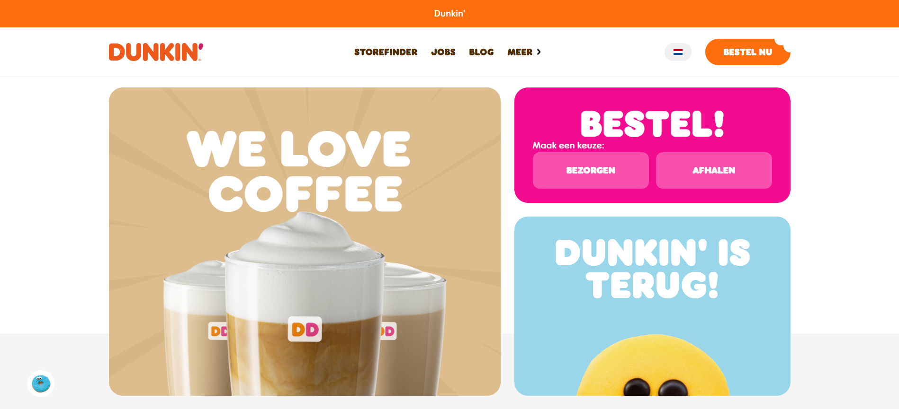
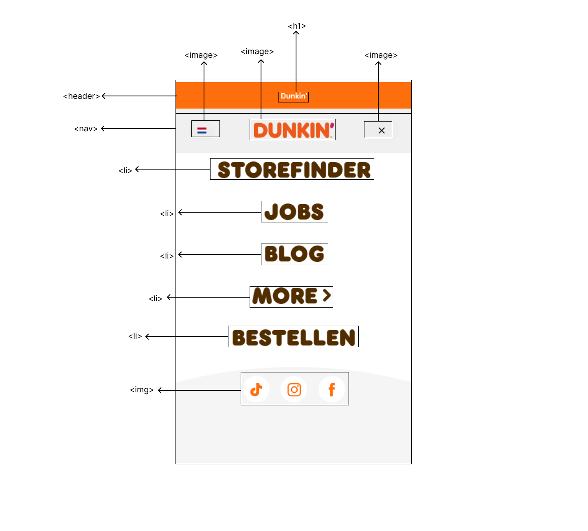
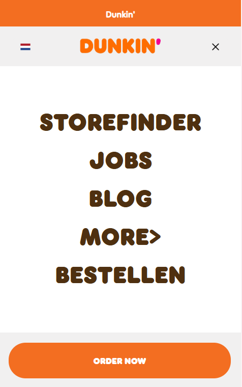
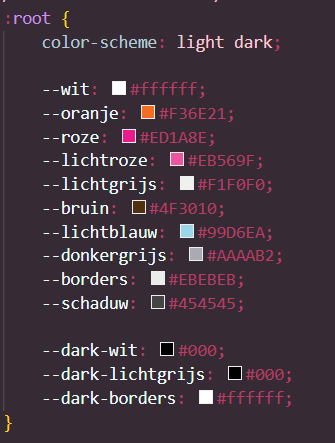
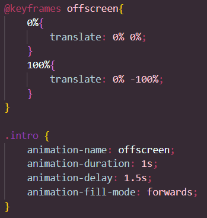
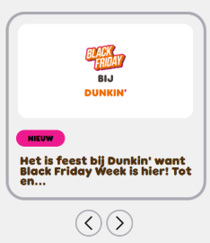

# Procesverslag
Markdown is een simpele manier om HTML te schrijven.  
Markdown cheat cheet: [Hulp bij het schrijven van Markdown](https://github.com/adam-p/markdown-here/wiki/Markdown-Cheatsheet).

Nb. De standaardstructuur en de spartaanse opmaak van de README.md zijn helemaal prima. Het gaat om de inhoud van je procesverslag. Besteedt de tijd voor pracht en praal aan je website.

Nb. Door *open* toe te voegen aan een *details* element kun je deze standaard open zetten. Fijn om dat steeds voor de relevante stuk(ken) te doen.

## Jij

  
uitwerken voor kick-off werkgroep

  ### Auteur:
  Hope van der Veen

  #### Je startniveau:
  Rood

  #### Je focus:
  Surface Plane
 

## Je website

  
Ik heb voor de eindopdracht ervoor gekozen om de website van Dunkin Donuts na te maken.

  ### Je opdracht:
  https://www.dunkin.nl/ 

  #### Screenshot(s) van de eerste pagina (small screen): 
  Homepagina
  

  #### Screenshot(s) van de tweede pagina (small screen):
  JobFinder
  
 

## Toegankelijkheidstest 1/2 (week 1)

  
uitwerken na test in 2e werkgroep

  ### Bevindingen
  Lijst met je bevindingen die in de test naar voren kwamen:
  ### Content
  - Use plain language and avoid figures of speech, idioms, and complicated metaphors. (Ze gebruiken makkelijke tekst en geen metaforen.)
  - Make sure that button, a (links) and label (in forms) content is unique and discriptive. (Niet discriptive genoeg.)

  ### Global Code
  - Validate your HTML. (Ze hadden heel veel errors in de console.)
  - Use a lang attribute on the html element. (Dit hebben ze gedaan.)
  - Provide a unique title for each page. (Dit hebben ze gedaan.)
  - Ensure that viewport zoom is not disabled. (Deze staat aan.)

  ### Keyboard
  - Make sure there is a visible focus style for interactive elements that are navigated (tab and shift + tab) to via keyboard input. (Er is een  duidelijke focusstate.)
  - Check to see that keyboard focus order matches the visual layout. (Alleen bij het bestellen van donuts is deze een beetje vaag, maar die pagina ga ik niet namaken.)

  ### Mobile and touch
  - Check that the site can be rotated to any orientation. (Dit kan.)
  - Remove horizontal scrolling. (Hebben ze gedaan.)
  - Ensure that button and link icons can be activated with ease (size and position). (Dit hebben ze gedaan.)
  - Ensure sufficient space between interactive items in order to provide a scroll area. (Dit hebben ze gedaan.)

  ### Headings
  - Use heading elements to introduce content. (Dit doen ze.)
  - Use only one h1 element per page or view. (Ze gebruiken meerdere h1 per pagina.)
  - Heading elements should be written in a logical sequence. (Ze gebruiken de heading elementen door elkaar heen.)
  - Don't skip heading levels. (Dit doen ze wel. Ze gaan van 2 naar 5 vanwege vormgeving.)

  ### Lists
  - Use list elements (ol,ul and dl elements) for list content. (Ze gebruiken div's.)

  ### Images
  - Make sure that all img elements have an alt attribute. (Die gebruiken ze wel, maar geen duidelijke alt text.)
  - Make sure that decorative images use null alt (empty) attribute values. (Ze hebben deze wel alt text gegeven.)
  - Provide a text alternative for complex images such as charts, graphs and maps. (Dit doen ze niet.)
  - For images containing text, make sure the alt description includes the image's text. (Ze beschrijven alleen de foto niet de text die erboven staat.)

  ### Media (Video and Audio)
  Niet van toepassing

  ### Controls
  - Use the a element for links. (Dit doen ze.)
  - Ensure that links are recognizable as links. (Dit doen ze.)
  - Ensure that controls have :focus states. (Dit hebben ze.)
  - Use the button element for buttons. (Ze gebruiken a of div.)
  - Provide a skip link and make sure that it is visible when focused. (Ze maken geen gebruik van een skiplink.)
  - Identify links that open in a new tab or window. (Je ziet niet aan de links of ze openen in een nieuw tabblad.)

  ### Appearance
  - Check if dark and light mode are supported. (Deze gebruiken ze.)
  - Check is high contrast mode is supported. (Deze gebruiken ze.)
  - Increase text size to 200%. (Dit kan.)
  - Make sure color isn't the only way information is conveyed. (Ze gebruiken ook letterdikte en grootte.)

  ### Animation
  - Ensure animations are subtle and do not flash to much. (Dit doen ze.)
  - Provide a mechanism to pause background video. (Dit hebben ze niet.)
  - Make sure all animation obeys the prefers-reduced-motion media query. (Dit hebben ze niet.)

  ### Color contrast
  - Check the contrast for all normal-sized text. (Sommige kleine tekst is dikgemaakt waardoor het moeilijk te lezen is voor mensen die slecht zien.)
  - Check the contrast for all large-sized text. (Hier is het contrast goed.)
  - Check the contrast for all icons. (De iconen hebben een goed contrast.)
  - Check text that overlaps images or video. (Hebben ze wel, maar het contrast is wel goed.)
  - Check custom ::selection colors. (Die gebruiken ze.)

## Breakdownschets (week 1)

  
uitwerken na afloop 3e werkgroep

  ### de hele pagina: 
  

  ### dynamisch deel (bijv menu): 
  

## Voortgang 1 (week 2)

  
uitwerken voor 1e voortgang

  ### Stand van zaken
  Ik vond de oefeningen die we hebben gedaan heel fijn om weer even in te komen. Ik had wat meer moeite met de Javascript dan de HTML en de CSS, maar ben er uiteindelijk wel uitgekomen. Ik heb er denk ik toch voor gekozen om responsive te gaan doen i.p.v Surface Plane. Ik heb hiervoor gekozen omdat ik denk dat ik dit later meer zal gebruiken en ik dit graag beter wil leren.

  ### Agenda voor meeting
  samen met je groepje opstellen

  | student 1      | student 2          | student 3    | student 4        |
  | ---            | ---                | ---          | ---              |
  |Hoe moet ik mijn|
  | font inladen?  | dit als er tijd is | nog een punt | dit wil ik zeker |
  | ...            | ...                | ...          | ...              |

  ### Verslag van meeting
  hier na afloop snel de uitkomsten van de meeting vastleggen

  - Breadownschetsen verbeteren.
  - Toegankelijkheids test uitbereiden.

## Voortgang 2 (week 3)

  
uitwerken voor 2e voortgang

  ### Stand van zaken
  Ik ben deze week begonnen aan de css, maar omdat ik het best complex vind ben ik nog niet super ver gekomen. Ik ga hier dit weekend en komende week meer tijd aan besteden.

  ### Agenda voor meeting
  samen met je groepje opstellen

  | student 1      | student 2          | student 3    | student 4        |
  | ---            | ---                | ---          | ---              |
  | De onderste    | en dit             | en ik dit    | en dan ik dat    |
  | button blijft  | dit als er tijd is | nog een punt | dit wil ik zeker |
  | niet op zijn   |                    |              |                  |
  | plek           | ...                | ...          | ...              |

  ### Verslag van meeting
  hier na afloop snel de uitkomsten van de meeting vastleggen

  - Bij het lettertype de wof weg of de /, want hij word niet ingeladen in github.
  - Gebruik custom properties

## Toegankelijkheidstest 2/2 (week 4)

  
uitwerken na test in 9e werkgroep

  ### Bevindingen
  Lijst met je bevindingen die in de test naar voren kwamen (geef ook aan wat er verbeterd is):

  ### Content
  - Use plain language and avoid figures of speech, idioms, and complicated metaphors. (Ik heb makkelijke tekst gebruikt en geen metaforen.)
  - Make sure that button, a (links) and label (in forms) content is unique and discriptive. (Ik heb de links discriptief gemaakt.)

  ### Global Code
  - Validate your HTML. (Ik heb geen errors in mijn HTML.)
  - Use a lang attribute on the html element. (Dit heb ik gedaan.)
  - Provide a unique title for each page. (Dit heb ik gedaan.)
  - Ensure that viewport zoom is not disabled. (Dit kan.)

  ### Keyboard
  - Make sure there is a visible focus style for interactive elements that are navigated (tab and shift + tab) to via keyboard input. (Er is een  duidelijke focusstate.)
  - Check to see that keyboard focus order matches the visual layout. (Het matcht de layout als ik niks aan mijn keyboard doe, maar als ik tab ga gebruiken slaat hij dingen over.)

  ### Mobile and touch
  - Check that the site can be rotated to any orientation. (Dit kan.)
  - Remove horizontal scrolling. (Heb ik gedaan.)
  - Ensure that button and link icons can be activated with ease (size and position). (Dit heb ik gedaan.)
  - Ensure sufficient space between interactive items in order to provide a scroll area. (Dit heb ik gedaan.)

  ### Headings
  - Use heading elements to introduce content. (Dit doen ik.)
  - Use only one h1 element per page or view. (Dit heb ik.)
  - Heading elements should be written in a logical sequence. (Ze staan bij mij in een logische volgorde.)
  - Don't skip heading levels. (Dit doe ik niet.)

  ### Lists
  - Use list elements (ol,ul and dl elements) for list content. (Ik heb ul's gebruikt.)

  ### Images
  - Make sure that all img elements have an alt attribute. (Dit heb ik gedaan.)
  - Make sure that decorative images use null alt (empty) attribute values. (Decoratieve foto's heb ik geen alt text gegeven.)
  - Provide a text alternative for complex images such as charts, graphs and maps. (Dit heb ik gedaan.)
  - For images containing text, make sure the alt description includes the image's text. (Dit heb ik gedaan.)

  ### Media (Video and Audio)
  Niet van toepassing

  ### Controls
  - Use the a element for links. (Dit heb ik.)
  - Ensure that links are recognizable as links. (Dit heb ik.)
  - Ensure that controls have :focus states. (Dit heb ik.)
  - Use the button element for buttons. (Dit heb ik.)
  - Provide a skip link and make sure that it is visible when focused. (Ik heb geen skiplink gemaakt.)
  - Identify links that open in a new tab or window. (Je ziet niet aan de links of ze openen in een nieuw tabblad.)

  ### Appearance
  - Check if dark and light mode are supported. (Dit heb ik.)
  - Check is high contrast mode is supported. (Dit heb ik.)
  - Increase text size to 200%. (Dit kan.)
  - Make sure color isn't the only way information is conveyed. (Ik gebruik ook letterdikte en grootte.)

  ### Animation
  - Ensure animations are subtle and do not flash to much. (Dit heb ik.)
  - Provide a mechanism to pause background video. (Dit heb ik niet.)
  - Make sure all animation obeys the prefers-reduced-motion media query. (Ik kan dit niet vinden op mijn laptop.)

  ### Color contrast
  - Check the contrast for all normal-sized text. (Ik heb bij de letters die ik te klein vond ervoor gezorgt dat ze nu groter waren.)
  - Check the contrast for all large-sized text. (Hier is het contrast goed.)
  - Check the contrast for all icons. (De iconen hebben een goed contrast.)
  - Check text that overlaps images or video. (Hebben ze wel, maar het contrast is wel goed.)
  - Check custom ::selection colors. (Die gebruik ik.)

## Voortgang 3 (week 4)

  
uitwerken voor 3e voortgang

  ### Stand van zaken
  Met de css is alles gelukt alleen weet ik niet zo goed hoe ik met de animaties moet beginnen.

  ### Agenda voor meeting
  samen met je groepje opstellen

  | student 1      | student 2          | student 3    | student 4        |
  | ---            | ---                | ---          | ---              |
  | Hoe hebben ze 
  | de intro gedaan| dit als er tijd is | nog een punt | dit wil ik zeker |
  | Hoe moet ik de 
  | animatie van de 
  | sections doen? | ...                | ...          | ...              |

  ### Verslag van meeting
  hier na afloop snel de uitkomsten van de meeting vastleggen

  - Css ziet er goed uit
  - Ga nu beginnen aan de animaties
  - Doe de custom properties

## Eindgesprek (week 5)

  
uitwerken voor eindgesprek

  ### Je uitkomst - karakteristiek screenshots:
  
   
   

  ### Dit ging goed/Heb ik geleerd: 
  Ik vond dat de CSS op deze website erg goed gelukt was en ben ook erg trots op hoe erg het op de echte site lijkt. 
  Wat ik heb geleerd is de custom properties gebruiken, light-dark mode maken en hoe ik moet animeren met keyframes.

  
  

  ### Dit was lastig/Is niet gelukt:
  Ik vond de carousel het lastigst. Ik heb hier ook het meeste hulp bij gezocht. Uiteindelijk is het wel gelukt.

  

## Bronnenlijst

  
continu bijhouden terwijl je werkt

  Nb. Wees specifiek ('css-tricks' als bron is bijv. niet specifiek genoeg). 
  Nb. ChatGpT en andere AI horen er ook bij.
  Nb. Vermeld de bronnen ook in je code.

  1. https://developer.mozilla.org/en-US/ (Voor animeren en bepaalde css properties)
  2. https://chatgpt.com/ (Geraadpleegd voor de carousel en de kennis toegepast in mijn code.)
  3. https://www.cssportal.com/css-clip-path-generator/#google_vignette (Om een custom clippath te maken)

